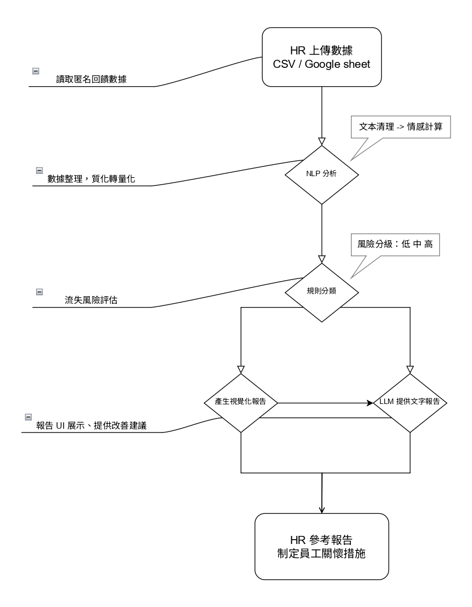

此為 113_2 資料結構課程使用

# 員工滿意度與流失風險分析系統

本系統旨在協助企業分析員工滿意度，預測流失風險，並提供改善建議。

  
<strong>📌 系統流程說明</strong>

## 1. HR 上傳數據（CSV 或 Google 表單）
**目標：** 讓 HR 能夠提交員工數據作為分析基礎。

**流程：**
- HR 透過系統上傳 CSV 檔案或 Google 表單數據。
- 資料包括：
  - **基本資訊**：員工 ID、年資、職位等。
  - **滿意度調查結果**：量化滿意度分數。
  - **員工回饋（文本資料）**：開放式意見。

## 2. 使用 NLP API 進行情感分析（TextBlob / VADER）
**目標：** 透過自然語言處理（NLP）分析員工回饋內容，提取情感分數。

**流程：**
- 使用 **TextBlob** 或 **VADER** 來計算情感分數（Positive/Neutral/Negative）。
- 將結果整合回原始數據。

## 3. 根據簡單規則分類離職風險
**目標：** 根據滿意度與情感分數預測離職風險。

**規則範例：**
- **高風險**：滿意度 < 3 且情感分數為 Negative。
- **中風險**：滿意度 3~4 或情感分數為 Neutral。
- **低風險**：滿意度 > 4 且情感分數為 Positive。

## 4. 產生視覺化報告（matplotlib / seaborn）
**目標：** 以圖表方式呈現分析結果，幫助 HR 直觀理解。

**視覺化內容：**
- 員工滿意度分布直方圖。
- 情感分數趨勢分析。
- 離職風險分類圓餅圖。

## 5. 透過 LLM 產生文字書面報告
**目標：** 透過大型語言模型（LLM，如 Gemini API）自動產生分析摘要與建議。

**報告內容範例：**
- 總體員工滿意度趨勢。
- 常見負面回饋關鍵詞分析。
- 建議 HR 可能的改善方向。

## 6. HR 參考結果，制定關懷措施
**目標：** 幫助 HR 依據數據制定員工關懷與改善策略。

**應用方式：**
- 針對高風險群體進行 1 對 1 訪談。
- 調整內部政策，如提高工作靈活性、改善薪資福利等。
- 追蹤改善後的數據變化，持續優化策略。

---
## 🔗 相關技術與工具
- **數據處理**：pandas
- **NLP**：TextBlob / VADER
- **視覺化**：matplotlib / seaborn
- **報告生成**：Gemini API / OpenAI GPT

此系統將協助企業更有效率地管理員工滿意度，降低流失率，並提升整體工作環境。🚀

  
<strong>HW1</strong>

  針對本周的作業，詳細系統架構可展開上方 **"系統流程說明"**，  
  程式碼替換作業請參考 [employee_satisfaction_test.py](test/employee_satisfaction_test.py)，  
  本次作業先嘗試以少量量化數據 [employee_satisfaction_test.csv](test/employee_satisfaction_test.csv)，  進行測試，確認 ai agent 能順利透過量化數據提供分析結果以及建議 [employee_satisfaction_report.csv](test/employee_satisfaction_report.csv)。
  

  
<strong>HW2</strong>

  針對本周的作業，程式碼請參考 [t318.py](test/DRai/t318.py)，  
  本次作業以員工主管 1:1 對話內容 [t318.csv](test/DRai/t318.csv) 替代原先資料，利用 ai agent 對內容語調進行評分，產出分析報告 [1on1_analysis.csv](test/DRai/1on1_analysis.csv)。  
  執行結果請參考 [HW2.png](HWSS/HW2.png)
  

  
<strong>HW3</strong>

  針對本周的作業，程式碼請參考 [postAItest.py](test/postAI/postAItest.py)，  
  本次作業以團隊溝通軟體 - Slack 為例，透過 Playwright 控制瀏覽器登入 Slack 並於指定的頻道發送訊息  
  執行結果請參考 [HW3.png](HWSS/HW3.png)
  

  
<strong>HW4</strong>

  針對本周的作業，程式碼請參考 [PDFconclu.py](test/HW4/PDFconclu.py) & [slack.py](test/HW4/slack.py)  
  本次作業以課程程式碼作為基礎，將 HW1 & HW2 作業中所產出的 csv 檔案重新交由 Gradio 介面下指令，並將回應內容製成 PDF - [report_1.pdf](test/HW4/report_1.pdf) & [report_2.pdf](test/HW4/report_2.pdf)，介面操作可參考 [satisfaction_ana.png](test/HW4/SS/satisfaction_ana.png) & [1on1_ana.png](test/HW4/SS/1on1_ana.png)  
  再透過 HW3 的方式，將兩份 PDF 檔案上傳至指定的 Slack 頻道，程式碼執行終端機及上傳截圖請參考 [slackterminal.png](test/HW4/SS/slackterminal.png) & [slack_post_result.png](test/HW4/slack_post_result.png)  
  

  
<strong>HW5</strong>

  針對本周的作業，程式碼請參考 [HW5](test/HW5)  
  本次作業利用課程所介紹之 Flask 後端搭配 Socket.IO 通訊，將 HW2 作業內容進行優化，為其設計前端功能  
  產出[評分圖表](test/HW5/static/rating_plot.png)的同時，提供整體對話數據的建議  
  本次測試中分別使用 [simu_dia_hig](test/HW5/data/simu_dia_hig.csv) 以及 [simu_dia_low](test/HW5/data/simu_dia_low.csv) 分別模擬高效溝通與低效溝通  
  執行結果可參考 [good](test/HW5/pic/good.png) & [bad](test/HW5/pic/bad.png)。  

